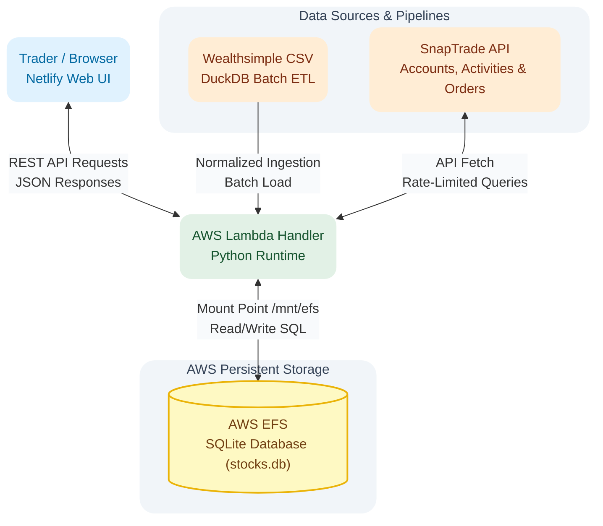

# Stock Trading App

> A tailored trade-tracking application that ingests multi-account API data into a custom database engine to compute non-standard position metrics and simulate trade outcomes.

---

## Technical Stack

* **Runtime and Compute:** Python 3.13, AWS Lambda, AWS SAM
* **Database and Data Pipeline:** SQLite3, DuckDB (Batch Data Ingestion, Cleaning, and Normalization), AWS EFS (Elastic File System)
* **Frontend:** Netlify (Web Interface)
* **APIs and Integrations:** SnapTrade API (Accounts, Activities, and Recent Orders endpoints), Wealthsimple CSV Ingestion
* **Development Environment:** Linux / WSL (Ubuntu), Native SQLite CLI, DB Browser for SQLite

---

## Project Context and Problem

I built this application for an active private trader managing multiple accounts on Wealthsimple. Since 2019, she tracked all transaction records manually using Excel. Her workflow required a separate Excel workbook for each trading account, with 10 to 15 stock-specific tabs per workbook, plus a master summary tab for analytical tracking. Managing four or five accounts meant constantly updating and switching between separate files and over 50 individual worksheet tabs.

This setup created two main operational challenges:

1. **Dual-Purpose Data Overhead:** The workbooks were forced to function as both a bookkeeping log for individual transactions and an analytical database (OLAP view) for tracking long-term stock performance. Every trade required manual updates across both the specific stock tab and the account summary tab.
2. **Reconciliation and Speed Limitations:** Manually re-entering trade data during active trading hours was slow and required constant comparison against Wealthsimple account balances to catch entry errors. Additionally, she needed to see her updated average purchase price immediately after every buy to make fast trading decisions.

---

## Solution and Core Features

I built a serverless web application that eliminates manual spreadsheet entry by processing historical Wealthsimple CSV exports through DuckDB and fetching ongoing trade data from the SnapTrade API into an SQLite database. The application transforms raw broker feeds to present all accounts and stocks on a single Netlify interface backed by an AWS Lambda API connected to AWS EFS.

### Key Capabilities

* **Automated Dual-Mode API Fetch:** Features two retrieval modes through SnapTrade: a 24-hour daily background sync for account activities, and a real-time (minute-by-minute) fetch for recent orders. Executing a trade in Wealthsimple and refreshing the web app immediately pulls the new transaction.
* **DuckDB Ingestion and Normalization Pipeline:** Uses DuckDB to parse, clean, and normalize legacy Wealthsimple CSV exports before loading them into SQLite, standardizing timezones, stock symbols, and unit definitions.
* **Rolling Aggregation View:** Uses a specialized database view (`transactions`) with SQL window functions to recalculate custom average purchase prices and position metrics immediately after every buy transaction.
* **Hypothetical Trade Calculator:** Includes a virtual testing tool where the trader can simulate buys or sells at specific market prices. The calculator generates a temporary row on screen to display expected gains, losses, and cost basis changes without committing data to the database. Once the real trade executes in Wealthsimple, refreshing the page replaces the simulation with the actual transaction.
* **Consolidated Analytical Views:** Merges multi-account data into a single interface, allowing the trader to toggle between account overviews and individual stock performance without changing files or opening multiple tabs.

---

## System Architecture



---

## Key Architectural Decisions

### Storage Provider: AWS EFS over Amazon S3
The backend uses SQLite hosted on an AWS Elastic File System (EFS) mounted directly to AWS Lambda at `/mnt/efs`. Because this is a single-user application, EFS provides a persistent filesystem that allows SQLite to execute direct read and write queries without the overhead of downloading and re-uploading database files from Amazon S3 on every Lambda invocation.

### Database Engine Selection: SQLite3 over Embedded Alternatives
I initially built a prototype using SQLite3, experimented with alternative embedded databases like Turtle DB, and then returned to SQLite3. Turtle DB lacked the flexible querying and window function capabilities required for running financial calculations. SQLite3 provided the necessary SQL analytical functions while keeping the deployment simple.

---

## Technical Challenges and Solutions

### 1. Reconciling Historical Baseline Gaps Between CSV and API Feeds
* **Context:** The trader's history begins in 2019, but SnapTrade API data cutoffs are incomplete and vary randomly by account (some APIs only provide history back to 2022, 2023, or 2025). Furthermore, account opening dates returned by the API are unreliable.
* **Solution:** Established a hybrid ingestion model. Historical trade data from 2019 onward is initialized using Wealthsimple CSV exports processed through a DuckDB pipeline, while ongoing daily activity and real-time order updates are layered on top via the SnapTrade API.

### 2. Normalizing CSV Data Discrepancies via DuckDB
* **Context:** Wealthsimple CSV exports contained several data inconsistencies: timestamps were formatted in local Pacific Time (Vancouver), stock ticker symbols included custom exchange extensions or legacy renamed tickers, and the `units` column was overloaded to represent both transaction quantities and portfolio holdings.
* **Solution:** Built a DuckDB ETL processing script to clean raw CSV records before database insertion. DuckDB converted Pacific timestamps into UTC ISO 8601 strings, mapped renamed tickers to standard symbols, and cleaned the `units` field to distinguish transaction quantities from total holdings.

### 3. Aligning Sign Conventions Across Feeds and Orders API
* **Context:** Wealthsimple CSVs and the SnapTrade Activities API follow cash-flow accounting signs (buys show negative cash amounts and positive units; sells show positive cash amounts and negative units). However, the SnapTrade Orders API (used for real-time 24-hour buy/sell updates) returns all numeric values as positive numbers without directional signs.
* **Solution:** Programmed a sign normalization module in Python for incoming Orders API payloads. The script evaluates the order action (Buy vs. Sell) and dynamically applies appropriate positive or negative signs to units and amounts before writing to the `activities` table. This aligns real-time order data with historical activity feeds, ensuring rolling position calculations in the database remain accurate.

### 4. Calculating Custom Metrics and Position Reset Cycles
* **Context:** Standard portfolio formulas could not handle the trader's requirement to recalculate average buy prices on purchases, hold cost bases steady on sales, incorporate dividends, and reset all metrics when a stock quantity hits zero.
* **Solution:** Built a dedicated database view (`transactions`) that executes window functions partitioned by account, symbol, and trade cycle (`PARTITION BY account_id, symbol, cycle_id`). When a sale reduces a position's share count to zero, an automated trigger increments the `cycle_id` counter for that stock. Subsequent buys use the new `cycle_id`, isolating the new position from historical trade calculations.

### 5. Managing SnapTrade API Rate Limits
* **Context:** SnapTrade enforces strict rate limits per minute across user accounts and global API keys. Calling account lists, daily activities, and real-time orders simultaneously risked hitting rate limits.
* **Solution:** Created a `last_fetch` database table that logs the data source, account ID, and timestamp of every API call. Before sending a request to SnapTrade, the Python backend checks `last_fetch` to ensure the cooldown window has passed, preventing unnecessary API calls.

---

## Database Schema Architecture

The application database consists of three persistent tables and one analytical view:

1. **`accounts` Table:** Stores trading account metadata fetched from the SnapTrade API.
2. **`activities` Table:** Unified table that stores normalized trade records from Wealthsimple CSV exports, SnapTrade daily activities, and real-time SnapTrade orders.
3. **`last_fetch` Table:** Logs API sync timestamps per endpoint and account to enforce rate limits.
4. **`transactions` View:** Analytical view that executes window functions (`PARTITION BY account_id, symbol, cycle_id`) across `activities` to compute rolling buy averages, current position holdings, and reset cycles dynamically.

### `last_fetch` Table Schema
```sql
CREATE TABLE last_fetch (
    source_type TEXT NOT NULL,       -- 'ACTIVITIES' or 'ORDERS'
    account_id TEXT NOT NULL,        -- Internal Account Identifier
    last_fetched_at TEXT NOT NULL,   -- UTC ISO 8601 Timestamp
    PRIMARY KEY (source_type, account_id)
);
```

### Partial Unique Constraint for API Deduplication
```sql
CREATE UNIQUE INDEX idx_snaptrade_dedup 
ON activities (account_id, symbol, transaction_timestamp, amount, units) 
WHERE source = 'SNAPTRADE';
```
