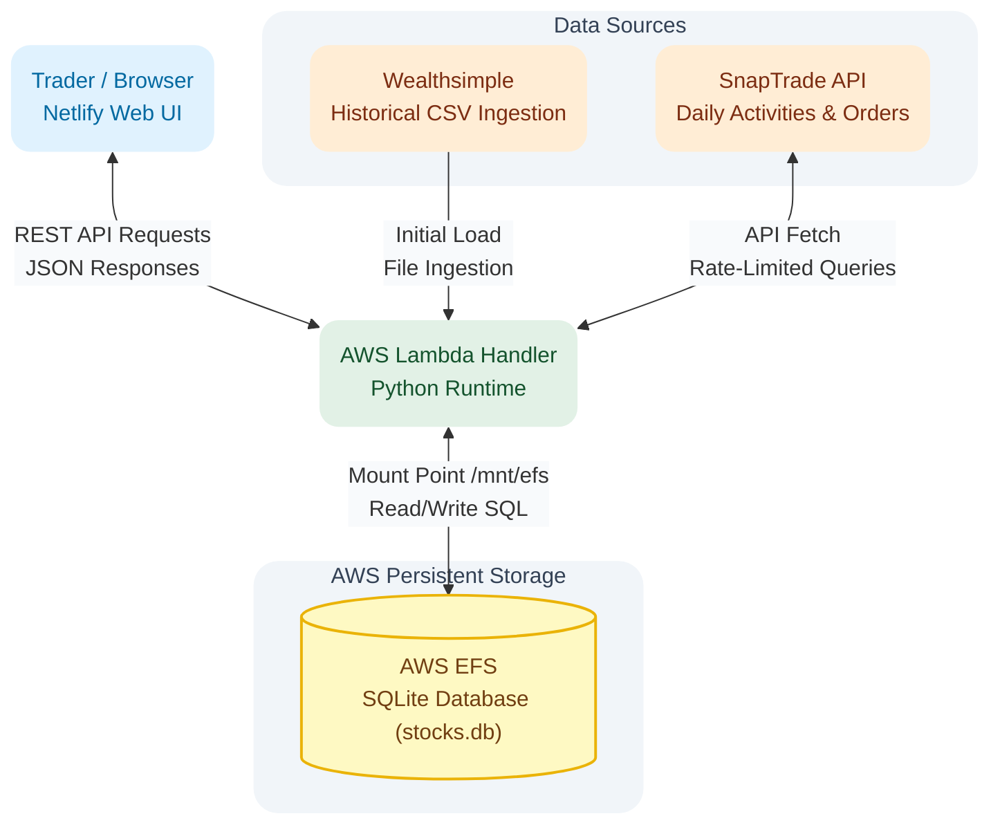

# Stock Trading App

> A tailored trade-tracking application that ingests multi-account API data into a custom database engine to compute non-standard position metrics and simulate trade outcomes.

---

## Technical Stack

* **Runtime and Compute:** Python 3.13, AWS Lambda, AWS SAM
* **Database and Storage:** SQLite3, AWS EFS (Elastic File System)
* **Frontend:** Netlify (Web Interface)
* **APIs and Integrations:** SnapTrade API (Daily Activities and Real-Time Orders endpoints), Wealthsimple CSV Ingestion
* **Development Environment:** Linux / WSL (Ubuntu), Native SQLite CLI, DB Browser for SQLite

---

## Project Context and Problem

I built this application for an active private trader managing multiple accounts on Wealthsimple. For five years, she tracked all transaction records manually using Excel. Her workflow required a separate Excel workbook for each trading account, with 10 to 15 stock-specific tabs per workbook, plus a master summary tab for analytical tracking. Managing four or five accounts meant constantly updating and switching between four or five separate files and over 50 individual worksheet tabs.

This setup created two main operational challenges:

1. **Dual-Purpose Data Overhead:** The workbooks were forced to function as both a bookkeeping log for individual transactions and an analytical database (OLAP view) for tracking long-term stock performance. Every trade required manual updates across both the specific stock tab and the account summary tab.
2. **Reconciliation and Speed Limitations:** Manually re-entering trade data during active trading hours was slow and required constant comparison against Wealthsimple account balances to catch entry errors. Additionally, she needed to see her updated average purchase price immediately after every buy to make fast trading decisions.

---

## Solution and Core Features

I built a serverless web application that eliminates manual spreadsheet entry by fetching trade data directly from Wealthsimple CSV exports and the SnapTrade API. The application presents all accounts and stocks on a single Netlify interface backed by an AWS Lambda API connected to an SQLite database on AWS EFS.

### Key Capabilities

* **Automated Dual-Mode API Fetch:** Features two retrieval modes through SnapTrade: a 24-hour daily background sync for account activities, and a real-time (minute-by-minute) fetch for recent orders. Executing a trade in Wealthsimple and refreshing the web app immediately pulls the new transaction.
* **Rolling Aggregation Engine:** Calculates the trader's custom average purchase price and position metrics using SQL rolling aggregations immediately after every buy transaction.
* **Hypothetical Trade Calculator:** Includes a virtual testing tool where the trader can simulate buys or sells at specific market prices. The calculator generates a temporary row on screen to display expected gains, losses, and cost basis changes without committing data to the database. Once the real trade executes in Wealthsimple, refreshing the page replaces the simulation with the actual transaction.
* **Consolidated Analytical Views:** Merges multi-account data into a single interface, allowing the trader to toggle between account overviews and individual stock performance without changing files or opening multiple tabs.

---

## System Architecture



---

## Key Architectural Decisions

### Storage Provider: AWS EFS over Amazon S3
The backend uses SQLite hosted on an AWS Elastic File System (EFS) mounted directly to AWS Lambda at `/mnt/efs`. Because this is a single-user application, EFS provides a persistent filesystem that allows SQLite to execute direct read and write queries without the overhead of downloading and re-uploading database files from Amazon S3 on every Lambda invocation.

### Database Engine Selection: SQLite3 over Embedded Alternatives
I initially built a prototype using SQLite3, experimented with alternative embedded databases like Turtle DB, and then returned to SQLite3. Turtle DB lacked the flexible querying and window function capabilities required for running financial calculations. SQLite3 provided the necessary SQL analytical functions while keeping the deployment simple.

### Lock-Free SQLite Configuration
To prevent process lock errors during local WSL development and serverless execution, the database connection uses two specific settings:

* **PRAGMA journal_mode = DELETE:** WAL (Write-Ahead Logging) mode creates sidecar files (`.wal` and `.shm`). If a background process or Lambda container shuts down unexpectedly, uncheckpointed commits in the `.wal` file can be lost or locked. Setting journal mode to `DELETE` writes commits directly to `stocks.db`, keeping the database as a single file without sidecars.
* **PRAGMA busy_timeout = 10000:** Instructs SQLite to wait up to 10 seconds for open read locks to clear before raising an `SQLITE_BUSY` (Error 5) exception.

---

## Technical Challenges and Solutions

### 1. Calculating Custom Metrics and Position Reset Cycles
* **Context:** Standard portfolio formulas could not handle the trader's requirement to recalculate average buy prices on purchases, hold cost bases steady on sales, incorporate dividends, and reset all metrics when a stock quantity hits zero.
* **Solution:** Wrote SQL queries using window functions (`PARTITION BY account_id, symbol, cycle_id`). Built logic into the ingestion pipeline that tracks total share quantities. When a sale reduces a position's share count to zero, an automated trigger increments the `cycle_id` counter for that stock. Subsequent buys use the new `cycle_id`, isolating the new position from historical trade calculations.

### 2. Managing SnapTrade API Rate Limits
* **Context:** SnapTrade enforces strict rate limits per minute across user accounts and global API keys. Calling account lists, daily activities, and real-time orders simultaneously risked hitting rate limits.
* **Solution:** Created a `LastFetch` database table that logs the data source, account ID, and timestamp of every API call. Before sending a request to SnapTrade, the Python backend checks `LastFetch` to ensure the cooldown window has passed, preventing unnecessary API calls.

### 3. Normalizing Timestamps and Stock Symbols Across Data Sources
* **Context:** Wealthsimple CSV exports use local Pacific Time (Vancouver) with microsecond strings and custom symbol formats. SnapTrade API responses use UTC ISO 8601 strings and standard ticker names.
* **Solution:** Built a Python normalization module that converts local Pacific Time strings into UTC ISO 8601 timestamps before database insertion. The module also maps ticker variations between Wealthsimple and SnapTrade to maintain consistent stock symbols in the database.

### 4. Handling Source-Specific Deduplication with Partial Constraints
* **Context:** SnapTrade API records include precise timestamps for trade deduplication. Wealthsimple CSV exports often group separate trades under identical timestamps and dollar amounts, causing standard unique constraints to reject valid trade records.
* **Solution:** Created a partial unique index in SQLite (`WHERE source = 'SNAPTRADE'`). This strictly prevents duplicate records from automated SnapTrade API pulls while allowing batch CSV trade entries from Wealthsimple imports.

---

## Database Schema Highlights

### `LastFetch` Table Schema
```sql
CREATE TABLE last_fetch (
    source_type TEXT NOT NULL,       -- 'ACTIVITIES' or 'ORDERS'
    account_id TEXT NOT NULL,        -- Internal Account Identifier
    last_fetched_at TEXT NOT NULL,   -- UTC ISO 8601 Timestamp
    PRIMARY KEY (source_type, account_id)
);
```

### Partial Unique Constraint for API Deduplication
```sql
CREATE UNIQUE INDEX idx_snaptrade_dedup 
ON transactions (account_id, symbol, transaction_timestamp, amount, units) 
WHERE source = 'SNAPTRADE';
```
